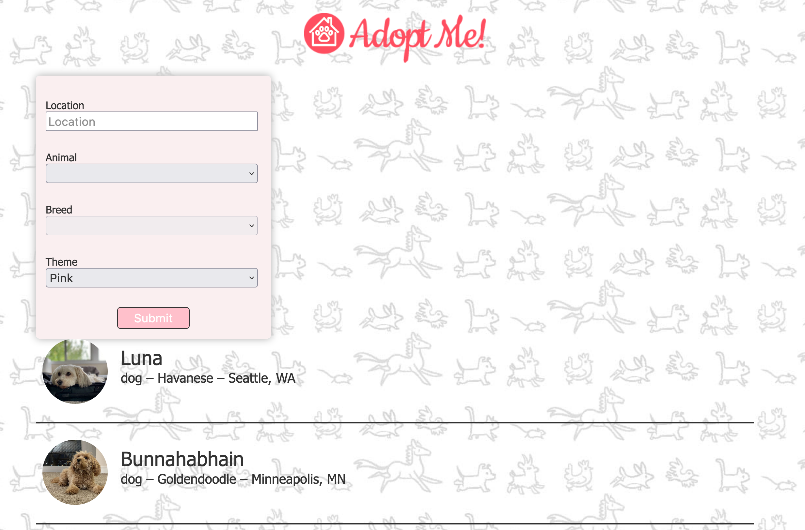
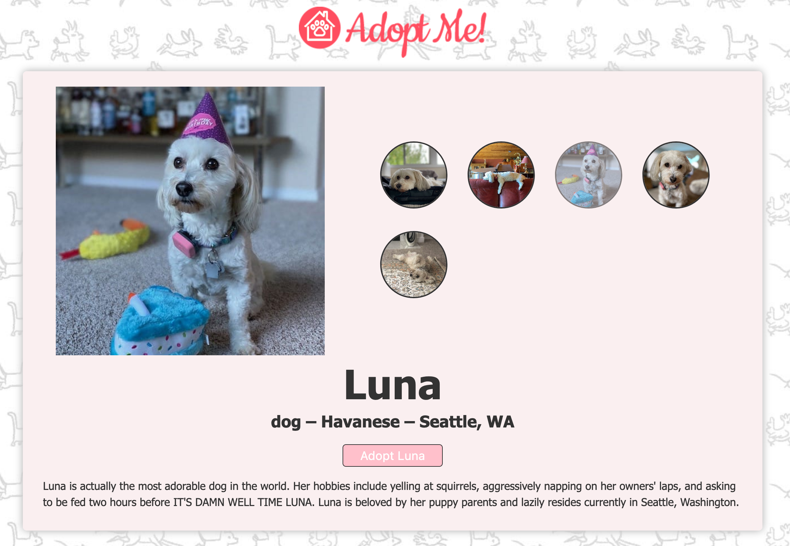

# Complete Intro to React, v7 - Adopt Me

App based on Frontend masters course taught by Brian Holt.
[See the course website here](https://frontendmasters.com/courses/complete-react-v7/).

### Screenshot




### How to run in development mode

```
git clone git@github.com:hellodajana/adopt-me.git
npm install
npm run dev
```
